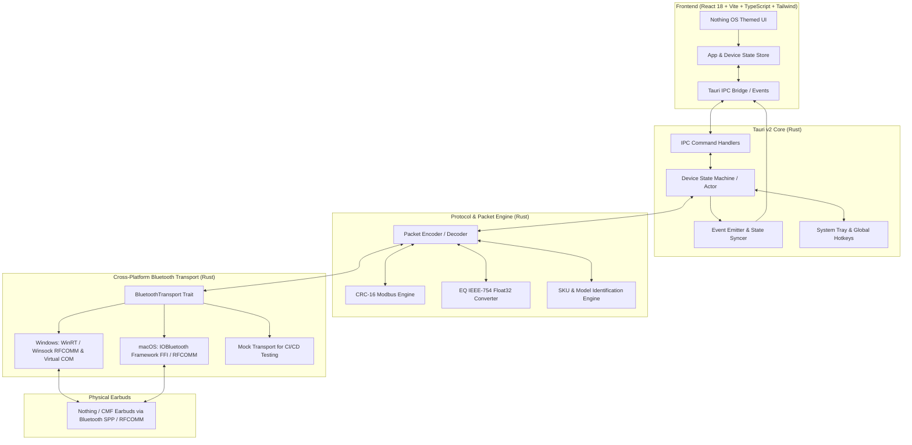
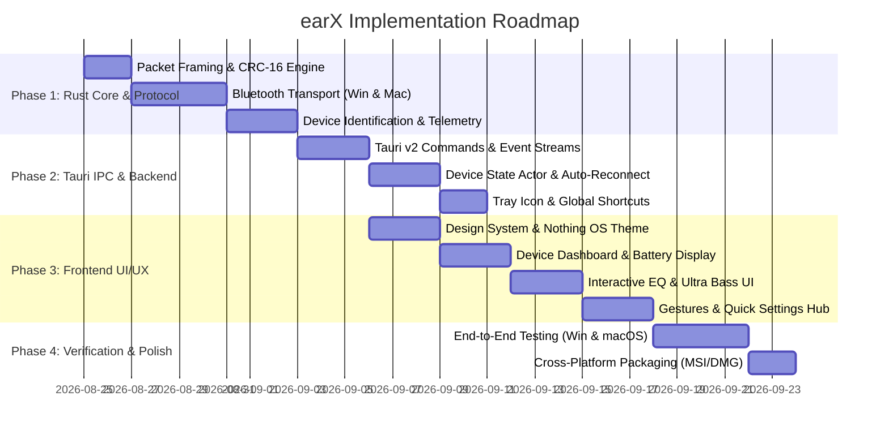

# earX — Architectural Design & Specification

**Cross-Platform Desktop Controller for Nothing & CMF Earbuds (Windows & macOS)**  
**Version:** 1.0.0-draft  
**Target Stack:** Tauri v2, Rust 1.78+, React 18 / Vite / TypeScript, Tailwind CSS  
**Target Hardware:** CMF Buds Pro 2 / CMF Buds 2 Plus, Nothing Ear, Nothing Ear (2), Nothing Ear (1), Nothing Ear (a), Nothing Ear (stick), Nothing Ear (open), CMF Buds, CMF Buds Pro, CMF Neckband Pro  

---

## 1. Executive Summary & Product Vision

### 1.1 Objective
`earX` is a native, ultra-lightweight, cross-platform desktop application designed to control, configure, and monitor Nothing and CMF audio devices on Windows (10/11) and macOS (12+). It replaces the need for Chromium-based Web Bluetooth browser apps or mobile-only apps by providing:
1. **Low-overhead Native Runtime:** Powered by Tauri v2 with a pure Rust Bluetooth backend and hardware-accelerated WebView frontend.
2. **System Tray / Menu Bar Resident:** Background battery monitoring, quick ANC toggles, and global keyboard shortcuts without keeping a heavy window open.
3. **Nothing OS Aesthetic:** Pixel-perfect monochrome and red accent industrial design inspired by Nothing OS and Teenage Engineering UI principles.
4. **Offline & Privacy-First:** Direct point-to-point RFCOMM/SPP communication with zero cloud dependencies, telemetry, or external network requests.

---

## 2. System Architecture



---

## 3. Communication Protocol & Binary Specification

The Nothing and CMF earbud ecosystem communicates over standard Bluetooth Classic RFCOMM using the Serial Port Profile (SPP).

### 3.1 Service UUIDs & Channels
* **SPP UUID:** `aeac4a03-dff5-498f-843a-34487cf133eb`
* **FastPair UUID:** `df21fe2c-2515-4fdb-8886-f12c4d67927c`
* **Baud Rate (Serial Emulation):** `9600` / `115200` (8 data bits, 1 stop bit, no parity)

---

### 3.2 Packet Structure & Framing

Every message sent to or received from the earbuds conforms to a binary frame:

```
+------------------------------------------------------------------------------------+
|  Byte 0  |  Byte 1  |  Byte 2  | Byte 3-4 |  Byte 5  |  Byte 6  |  Byte 7  | Byte 8..N | Byte N+1..N+2 |
+------------------------------------------------------------------------------------+
|   0x55   |   0x60   |   0x01   | Command  | Payload  | Reserved | Sequence |  Payload  |    CRC-16     |
| (Magic)  | (Magic)  | (Version)| (Uint16LE|  Length  |  (0x00)  |  Number  |   Bytes   |  (Uint16LE)   |
+------------------------------------------------------------------------------------+
```

#### Field Breakdown:
1. **Magic Bytes (0x55, 0x60, 0x01):** Fixed 3-byte synchronization header.
2. **Command ID (2 bytes, Little-Endian):** Identifies the read/write operation.
3. **Payload Length (1 byte):** Length $L$ of the payload in bytes ($0 \le L \le 255$).
4. **Reserved (1 byte):** Set to `0x00`.
5. **Sequence Number / Operation ID (1 byte):** Increments per command ($1 \to 250$, resets to $1$).
6. **Payload ($L$ bytes):** Command-specific data arguments.
7. **CRC-16 (2 bytes, Little-Endian):** Computed over all preceding bytes (header + payload).

#### CRC-16 Algorithm:
* **Polynomial:** `0xA001` (Modbus / IBM reverse)
* **Initial Value:** `0xFFFF`
* **Calculation:**
```rust
pub fn compute_crc16(data: &[u8]) -> u16 {
    let mut crc: u16 = 0xFFFF;
    for &byte in data {
        crc ^= byte as u16;
        for _ in 0..8 {
            if (crc & 1) != 0 {
                crc = (crc >> 1) ^ 0xA001;
            } else {
                crc >>= 1;
            }
        }
    }
    crc
}
```

---

### 3.3 Command Matrix & Telemetry Specifications

| Command ID (Hex) | Command ID (Dec) | Direction | Function | Response ID (Hex / Dec) | Description |
|---|---|---|---|---|---|
| `0xC006` | `49158` | Out | Request Serial Number | `0x4006` / `16390` | Retrieves hardware serial string for SKU identification |
| `0xC007` | `49159` | Out | Read Battery Levels | `0xE001` / `57345` or `0x4007` / `16391` | Fetches left, right, and case battery status + charging states |
| `0xC01E` | `49182` | Out | Read ANC Status | `0xE003` / `57347` or `0x401E` / `16414` | Fetches active noise cancellation mode |
| `0xF00F` | `61455` | Out | Set ANC Status | Ack / Status | Sets ANC mode (Off, Transparency, Noise Cancellation, Levels) |
| `0xC01F` | `49183` | Out | Read EQ Profile | `0x401F` / `16415` or `0x4050` / `16464` | Standard preset EQ read (Balanced, Voice, Treble, Bass, Custom) |
| `0xF010` | `61456` | Out | Set EQ Profile | Ack | Sets standard preset EQ mode |
| `0xC050` | `49232` | Out | Read Listening Mode | `0x4050` / `16464` | Used on newer models (B172/B168) for EQ/Listening mode |
| `0xF01D` | `61469` | Out | Set Listening Mode | Ack | Sets listening mode on B172/B168 |
| `0xC04E` | `49230` | Out | Read Enhanced Bass | `0x404E` / `16462` | Reads Ultra Bass / Bass Enhance enable state and level (0–5) |
| `0xF051` | `61521` | Out | Set Enhanced Bass | Ack | Configures Bass Enhance `[enabled, level * 2]` |
| `0xC04C` | `49228` | Out | Read Advanced EQ | `0x404C` / `16460` | Reads Advanced 8-band parametric EQ enable state |
| `0xF04F` | `61519` | Out | Set Advanced EQ | Ack | Enables/disables advanced parametric EQ |
| `0xC044` | `49220` | Out | Read Custom EQ | `0x4044` / `16452` | Reads 3-band simple custom EQ (Bass, Mid, Treble in float32) |
| `0xF041` | `61505` | Out | Set Custom EQ | Ack | Writes 3-band simple custom EQ (Bass, Mid, Treble) |
| `0xC00E` | `49166` | Out | Read In-Ear Detection | `0x400E` / `16398` | Reads wear detection auto-pause setting |
| `0xF004` | `61444` | Out | Set In-Ear Detection | Ack | Enables (`0x01`) or disables (`0x00`) wear detection |
| `0xC041` | `49217` | Out | Read Low Latency Mode | `0x4041` / `16449` | Reads gaming low-latency mode state |
| `0xF040` | `61504` | Out | Set Low Latency Mode | Ack | Sets low latency (`0x01` on, `0x02` off) |
| `0xC020` | `49184` | Out | Read Personalized ANC | `0x4020` / `16416` | Reads Personalized ANC test status |
| `0xF011` | `61457` | Out | Set Personalized ANC | Ack | Enables/disables personalized ANC |
| `0xC018` | `49176` | Out | Read Gestures | `0x4018` / `16408` | Reads gesture action bindings for stems/touch controls |
| `0xF003` | `61443` | Out | Set Gesture Binding | Ack | Writes gesture action binding `[0x01, device, 0x01, type, action]` |
| `0xC042` | `49218` | Out | Read Firmware Version | `0x4042` / `16450` | Reads firmware string (e.g. `1.0.1.37`) |
| `0xF002` | `61442` | Out | Find / Ring Earbuds | Ack | Triggers ringing on left (`0x02, 0x01`), right (`0x03, 0x01`), or stop (`0x00`) |
| `0xF014` | `61460` | Out | Launch Ear Tip Fit Test | `0xE00D` / `57357` | Runs acoustic fit seal test; responses indicate pass/fail per ear |
| `0xC017` | `49175` | Out | Read LED Case Color | `0x4017` / `16407` | Nothing Ear (1) only: reads RGB case LED status |
| `0xF00D` | `61453` | Out | Set LED Case Color | Ack | Nothing Ear (1) only: writes 5-element RGB color array |

---

### 3.4 In-Depth Payload Decoding

#### 1. Battery Telemetry (`0xE001` / `57345` or `0x4007` / `16391`)
* `payload[0]` (byte 8): Number of reporting sub-devices (usually $3$: Left, Right, Case).
* For each device ($i = 0..\text{count}-1$):
  * `deviceId = payload[1 + i*2]`: `0x02` = Left Earbud, `0x03` = Right Earbud, `0x04` = Charging Case.
  * `dataByte = payload[2 + i*2]`:
    * `batteryLevel = dataByte & 0x7F` ($0 \dots 100\%$)
    * `isCharging = (dataByte & 0x80) == 0x80` (boolean)

#### 2. Active Noise Cancellation (`ANC`)
* **Payload mapping for Set ANC (`0xF00F`):**
  * `[0x01, ANC_BYTE, 0x00]`
  * Mode values:
    * `1` $\to$ High / Strong (`0x05`)
    * `2` $\to$ Mid / Medium (`0x07`)
    * `3` $\to$ Low / Weak (`0x03`)
    * `4` $\to$ Transparency Mode (`0x01`)
    * `5` $\to$ Off (`0x02`)
    * `6` $\to$ Adaptive / Smart ANC (`0x04`)

#### 3. Custom 3-Band EQ IEEE-754 Float Encoding
Nothing earbuds use an IEEE-754 32-bit float array formatted in reverse endianness with a special sign-bit inversion for EQ gain values ($-6.0\text{dB} \dots +6.0\text{dB}$):
* **Float encoding algorithm:**
  1. Encode float as IEEE-754 32-bit big-endian bytes $[b_0, b_1, b_2, b_3]$.
  2. Swap byte order: $[b_3, b_2, b_1, b_0]$.
  3. If negative, invert MSB mask.
* Outbound packet for `0xF041`:
  * Byte 0: `0x03` (3 bands: Bass, Mid, Treble).
  * Bytes 1–4: Pre-amp gain (calculated as $-\max(\text{values})$).
  * Bytes 5–17: Band 1 descriptor (Bass @ 80Hz, Q=0.7, Gain).
  * Bytes 18–30: Band 2 descriptor (Mid @ 1000Hz, Q=0.7, Gain).
  * Bytes 31–43: Band 3 descriptor (Treble @ 8000Hz, Q=0.7, Gain).

---

## 4. Hardware & SKU Mapping Database

The app decodes the device hardware identity from the Serial Number (`0xC006`) response or SKU substring:

| Base ID | Model Name | Code Name | SKU Identifiers | Supported Features |
|---|---|---|---|---|
| **B172** | **CMF Buds Pro 2 / 2 Plus** | *espeon* | `76`, `77`, `78`, `79`, `80`, `81`, `82`, `83` | Smart ANC (4 levels + Trans), Ultra Bass (0-5), Listening Modes, Dual Conn, In-Ear, Low Latency, Fit Test, Custom Gestures, Smart Dial on Case |
| **B168** | **CMF Buds** | *donphan* | `54`, `55`, `56`, `57`, `58`, `59` | ANC (3 levels + Trans), Ultra Bass (0-5), Listening Modes, In-Ear, Low Latency, Find Buds |
| **B163** | **CMF Buds Pro** | *corsola* | `30`, `31`, `32`, `33`, `34`, `35` | ANC (High/Mid/Low/Trans), 3-band EQ, In-Ear, Low Latency, Find Buds |
| **B164** | **CMF Neckband Pro** | *crobat* | `48`, `49`, `50`, `51`, `52`, `53` | ANC (50dB Hybrid), Ultra Bass, In-Ear, Low Latency |
| **B171** | **Nothing Ear (2024)** | *entei* | `61`, `62`, `69`, `70`, `74`, `75` | Smart ANC (45dB), Advanced 8-band EQ + 3-band EQ, Ultra Bass, In-Ear, Low Latency, Personalized ANC, Fit Test |
| **B162** | **Nothing Ear (a)** | *cleffa* | `63`, `64`, `65`, `66`, `67`, `68`, `71`, `72`, `73` | Smart ANC (45dB), Ultra Bass, 3-band EQ, In-Ear, Low Latency, Fit Test |
| **B155** | **Nothing Ear (2)** | *two* | `17`, `18`, `19`, `27`, `28`, `29` | Personalized ANC, Advanced EQ, In-Ear, Low Latency, Dual Conn, Fit Test |
| **B157** | **Nothing Ear (stick)** | *sticks* | `14`, `15`, `16`, Serial prefix `MA` (2022/2023) | 3-band EQ, In-Ear, Low Latency, Bass Lock |
| **B174** | **Nothing Ear (open)** | *flaaffy* | `11200005`, Serial prefix `MA` (2024) | Open-ear audio, Bass Enhance, 3-band EQ, Low Latency |
| **B181** | **Nothing Ear (1)** | *one* | `01`, `02`, `03`, `04`, `06`, `07`, `08`, `10` | ANC (Light/Maximum/Trans), 3-band EQ, In-Ear, Case LED RGB Control, Ringing |

---

## 5. Cross-Platform Bluetooth Engine (Rust)

To run natively on Windows and macOS without Chromium dependencies, the Rust backend implements a unified transport abstraction.

### 5.1 Transport Architecture

```rust
#[async_trait]
pub trait BluetoothTransport: Send + Sync {
    /// Scan for paired / discoverable Nothing and CMF devices
    async fn scan_devices(&self) -> Result<Vec<DiscoveredDevice>, TransportError>;
    
    /// Connect to a specific device via RFCOMM / SPP
    async fn connect(&mut self, device_address: &str) -> Result<(), TransportError>;
    
    /// Send raw binary frame
    async fn send(&mut self, frame: &[u8]) -> Result<(), TransportError>;
    
    /// Read next incoming packet stream
    async fn receive(&mut self) -> Result<Vec<u8>, TransportError>;
    
    /// Close connection
    async fn disconnect(&mut self) -> Result<(), TransportError>;
}
```

### 5.2 Windows Implementation Strategy
1. **Primary: Windows Sockets (Winsock `AF_BTH`) / WinRT RFCOMM:**
   * Utilizes `windows` crate (`windows::Devices::Bluetooth::Rfcomm::RfcommDeviceService`).
   * Opens an asynchronous bidirectional RFCOMM stream to SPP UUID `aeac4a03-dff5-498f-843a-34487cf133eb`.
2. **Fallback: Virtual Serial COM Ports:**
   * Uses `serialport` crate to detect and open paired Bluetooth COM ports (`COM3`, `COM4`, etc.) if raw socket access is restricted.

### 5.3 macOS Implementation Strategy
1. **Primary: `IOBluetooth` Framework FFI:**
   * Leverages `objc2` and `IOBluetooth.framework` to bind to `IOBluetoothDevice` and `IOBluetoothRFCOMMChannel`.
   * Directly opens RFCOMM channel to SPP Service UUID.
2. **Fallback: Virtual TTY Device (`/dev/cu.Bluetooth-Incoming-Port` / paired device TTY):**
   * Uses POSIX serial stream via `tokio-serial`.

---

## 6. Frontend Architecture & Design System

### 6.1 Design Tokens & Nothing OS Aesthetic
* **Typography:**
  * Primary Headings: `NDot 55` / `NDot 57` (dot-matrix display font)
  * Secondary / UI Labels: `Space Grotesk` (clean geometric grotesk)
  * Numbers & Technical Data: `Roboto Mono` / `Space Grotesk Medium`
* **Color Palette:**
  * Background Main: `#121212` / `#18181b` (deep carbon black)
  * Surface Dark: `#21201f` / `#27272a` (elevated card container)
  * Accent Red: `#d71920` / `#e82525` (signature Nothing red)
  * Text Primary: `#ffffff`
  * Text Secondary: `#a1a1aa` (subtle zinc)
  * Border Accent: `rgba(255, 255, 255, 0.1)`

### 6.2 Key Screen Views & Layouts
1. **Device Dashboard (`/`):**
   * High-resolution earbud visualizer (Left Bud, Case, Right Bud with live charging indicators and % battery badges).
   * Connection status banner (Connected, Disconnected, Syncing).
   * Quick Noise Control switcher (Noise Cancellation [High/Mid/Low/Adaptive], Transparency, Off).
2. **Equalizer Hub (`/equalizer`):**
   * Preset selector (Balanced, More Bass, More Treble, Voice, Custom).
   * Interactive 3-Band Wave Equalizer with smooth SVG curve interpolation.
   * Advanced 8-Band Parametric EQ (for B171/B155) with frequency/Q/gain sliders and real-time visualization.
   * Ultra Bass / Enhanced Bass slider ($0 \dots 5$).
3. **Gestures & Controls (`/gestures`):**
   * Left & Right earbud interactive selector.
   * Pinch / Tap mapping: Double Pinch, Triple Pinch, Pinch & Hold, Double Pinch & Hold.
   * Action selection dropdowns: Play/Pause, Next Track, Previous Track, Voice Assistant, Noise Control toggle, Volume Up/Down.
4. **Device Settings & Tools (`/settings`):**
   * In-Ear Wear Detection toggle.
   * Low Latency Mode toggle.
   * Dual Connection / Multipoint management.
   * Ear Tip Fit Test wizard with acoustic seal diagnostic feedback.
   * Find My Earbuds (left/right audio beacon trigger).
   * Firmware version, serial number, and raw communication diagnostic console.

---

## 7. System Tray & Desktop Integration

* **Windows Taskbar Tray / macOS Menu Bar Extra:**
  * Custom dynamic tray icon displaying active device connection and left/right/case battery levels.
  * Right-click context menu:
    * Quick ANC Mode Toggle (ANC On $\leftrightarrow$ Transparency $\leftrightarrow$ Off).
    * Bass Enhance toggle.
    * Open Dashboard.
    * Reconnect Device.
    * Quit.
* **Global Hotkeys (Configurable):**
  * `Ctrl+Shift+A` (Win) / `Cmd+Shift+A` (Mac): Toggle ANC Mode.
  * `Ctrl+Shift+B` (Win) / `Cmd+Shift+B` (Mac): Toggle Bass Enhance.
  * `Ctrl+Shift+M` (Win) / `Cmd+Shift+M` (Mac): Toggle Low Latency Mode.
* **Background Daemon Mode:**
  * Closing the main window minimizes `earX` to the tray instead of terminating.
  * Automatic reconnection handler when computer wakes from sleep or Bluetooth is toggled.

---

## 8. Implementation Roadmap & Milestones



---

## 9. Security, Privacy & Performance Invariants

1. **Zero Cloud / Zero Network:** No outbound HTTP/HTTPS requests. Pure local Bluetooth communication.
2. **Secrets & Privacy:** Under no circumstances should user system secrets or tokens be accessed.
3. **Bluetooth Stream Safety:** All packet transmissions are serialized through an asynchronous actor queue with 100ms pacing during initialization to prevent hardware buffer overruns.
4. **Fail-Safe CRC:** Every inbound and outbound frame is verified with CRC-16; corrupt packets are safely dropped with error logging.
5. **Memory Footprint:** Application idling in tray target: $< 35\text{MB}$ RAM.
